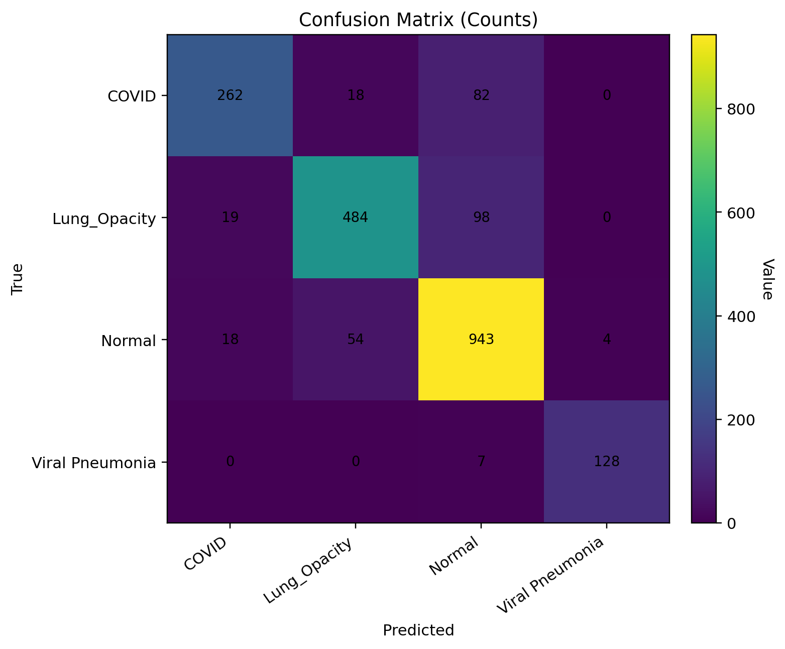

🫁 ChestLite — X-Ray Triage Assistant (Windows • Keras/TensorFlow)

Research/Education only — not a medical device. Outputs are assistive and must not be used for clinical decisions without expert review.

🚀 What this repo gives you

Training script (train_covid_cxr.py) for multi-class CXR classification (DenseNet121).

Artifacts saved automatically: model.h5, label_encoder.pkl, config.yaml, metrics.json, history.json/.csv, confusion_matrix.json, predictions_test.csv.

Visualization (Jupyter-friendly) cell/script to show & save:

Accuracy/Loss curves

Confusion-matrix heatmaps (counts + row-normalized)

Prediction (Jupyter-friendly) cell to run inference on a single image or a folder, saving predictions_infer.csv (per-class probs, top-1 label/score, triage flag).

Everything is pre-configured to your dataset paths on Windows.

📂 Expected data on your machine

Your dataset (images & masks) is in:

C:\Users\NXTWAVE\Downloads\COVID Radiography Detection\archive\COVID-19_Radiography_Dataset\
├─ COVID\images\      # used (classification)
├─ COVID\masks\       # present, but ignored here
├─ Lung_Opacity\images\
├─ Lung_Opacity\masks\
├─ Normal\images\
├─ Normal\masks\
├─ Viral Pneumonia\images\
└─ Viral Pneumonia\masks\

Note: The current pipeline is classification-only and uses the images folders. masks are ignored (those are for segmentation; you can add a U-Net later if you want lesion overlays).

🧰 Environment setup (Windows)
# In PowerShell or CMD
cd "C:\Users\NXTWAVE\Downloads\COVID Radiography Detection"

python -m venv .venv
.\.venv\Scripts\activate

pip install --upgrade pip
pip install "tensorflow>=2.10" scikit-learn pandas numpy pyyaml pillow matplotlib

If you have an NVIDIA GPU and want acceleration, install the matching CUDA/cuDNN per TensorFlow’s GPU install guide.

🏋️ Train

Save the training script as train_covid_cxr.py in
C:\Users\NXTWAVE\Downloads\COVID Radiography Detection\
(You already have the full script from our chat; it includes JSON-safe saving.)

Run:

.\.venv\Scripts\activate
cd "C:\Users\NXTWAVE\Downloads\COVID Radiography Detection"
python train_covid_cxr.py

What gets saved (auto)
C:\Users\NXTWAVE\Downloads\COVID Radiography Detection\artifacts\
├─ model.h5
├─ label_encoder.pkl
├─ class_indices.json
├─ config.yaml
├─ metrics.json
├─ history.json
├─ history.csv
├─ confusion_matrix.json
└─ predictions_test.csv

metrics.json includes validation & test accuracy, macro-F1, per-class AUROC (one-vs-rest), a classification report, and confusion matrix.

config.yaml captures config, paths, class names, and artifact locations.

📈 Show accuracy graph & heatmap (Jupyter-friendly)

Why this version? Jupyter passes a -f <kernel>.json arg automatically. We avoid argparse so it runs clean in notebooks.

Open Jupyter in the same environment:

.\.venv\Scripts\activate
jupyter notebook

Create a new notebook and paste the “Jupyter-friendly plotting cell” you got earlier (named in our chat as JUPYTER-FRIENDLY: show accuracy curves + confusion-matrix heatmaps).
It will:

Display plots inline

Save PNGs to artifacts\:

accuracy_curve.png

loss_curve.png

confusion_matrix.png

confusion_matrix_norm.png

If you prefer a script instead of a notebook, save our show_cxr_metrics.py and run:

python show_cxr_metrics.py

🔮 Run predictions (Jupyter-friendly)

Paste the “Jupyter-friendly inference” cell from our chat into a notebook.
Set INPUT_PATH to a single image or a folder (it scans recursively):

# examples inside the cell
INPUT_PATH = r"C:\Users\NXTWAVE\Downloads\COVID Radiography Detection\archive\COVID-19_Radiography_Dataset\Normal\images"

Run the cell. It will:

Load artifacts\model.h5 and label_encoder.pkl.

Create artifacts\predictions_infer.csv with:

path

pred_label, pred_score

triage_label (Abnormal / Likely Normal)

triage_prob_abnormal

prob_<ClassName> columns for every class

You’ll also see a preview DataFrame inline and a concise printout for a few files.

Triage logic: If your class list contains "Normal", we compute p_abnormal = 1 - p(Normal) and call it Abnormal if p_abnormal ≥ 0.5. If there’s no Normal class, we treat 1 - max(prob) as abnormality score.

⚙️ Model details (current defaults)

Backbone: DenseNet121 (ImageNet-pretrained), top replaced with GlobalAvgPool + Dropout(0.2) + Dense softmax.

Input: 224×224 RGB, ImageNet mean/std normalization.

Augmentations: light (random horizontal flip, slight brightness/contrast).

Loss/Metric: Sparse categorical cross-entropy / Accuracy.

Splits: 10% test (held out) + 10% of the remainder for validation (stratified).

Classes: inferred from your folder names → ["COVID", "Lung_Opacity", "Normal", "Viral Pneumonia"] (order saved in encoder).

You can change hyper-params inside CFG at the top of train_covid_cxr.py.

📊 Interpreting outputs

Accuracy/Loss curves help diagnose under/overfitting.

Confusion matrix (counts + normalized) shows which classes are confused (e.g., COVID vs Viral Pneumonia).

Per-class metrics in metrics.json > test > classification_report.
A convenience F1 bar plot can be added if you want (ask me, I’ll include a small function).

🧪 Reproducibility

Seeding is enabled (seed: 42) for TF, NumPy, Python.

True determinism can still vary with GPU kernels/cuDNN; for highly deterministic runs you may need to set additional TF environment flags.

🛠️ Troubleshooting

TypeError: Object of type float32 is not JSON serializable
Fixed: the training script already converts all NumPy/TF types to plain Python (to_py) before json.dump.

argparse error in Jupyter (unrecognized -f …)
Use the Jupyter-friendly cells provided (no CLI args). Or run scripts from terminal.

No images found
Re-check your paths. The script expects images under the images subfolders and filters by extensions: .jpg/.jpeg/.png/.bmp.

GPU/TF not using GPU
Verify tf.config.list_physical_devices('GPU'), install the correct CUDA/cuDNN, and ensure driver versions match your TF build.

Poor metrics
Try: unfreezing some DenseNet blocks, longer training, heavier augmentation, class-weighting/oversampling, or a different backbone (EfficientNet, ViT).

🗺️ Roadmap (nice-to-haves)

Grad-CAM overlays for interpretability (Keras hooks on DenseNet blocks).

Export to ONNX for cross-framework inference.

FastAPI/Gradio mini-app for drag-and-drop triage + PDF report (like we did for ChestLite design).

Optional segmentation head to leverage your masks for lesion maps.

If you want any of these now, say the word and I’ll drop the code tailored to your current artifacts.
